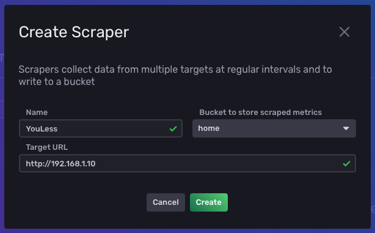

# YouLess LS120 Prometheus Bridge

This project exposes LS120 metrics in the prometheus text format, so it can be imported by influxdb 2.0 or prometheus.


## Usage

For these commands I am assuming that your YouLess LS120 has the following address: http://192.168.1.12

Docker CLI:
```bash
docker run --publish 80:80 chappio/youless-prometheus http://192.168.1.12
```

Docker Compose:
```yml
version: '3.6'

services:
  youless:
    image: chappio/youless-prometheus
    ports:
      - 80:80
    command: http://192.168.1.12
```


Now the bridge is listening to all HTTP requests on http://localhost. You can now point InfluxDB 2.0 or Prometheus at this bridge.

Assuming your bridge IP is 192.168.1.10:

